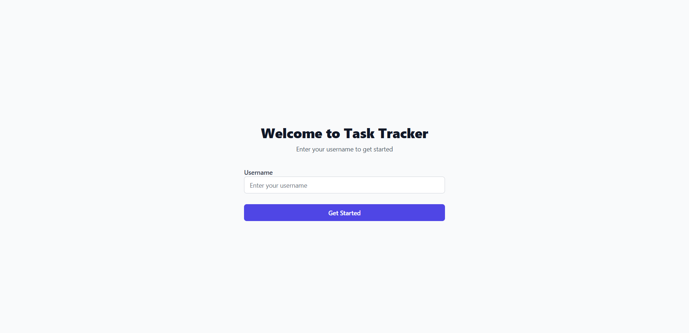

# Personal Task Tracker

## 📖 Description

A modern, responsive personal task management application built with React. This application allows users to create, manage, and organize their tasks with advanced filtering capabilities, priority levels, due dates, and a beautiful dark/light mode interface. Perfect for personal productivity and task organization.

## 🚀 Features

### Core Functionality
- **🔐 Simple Login System** - Username-based authentication with localStorage persistence
- **📝 Task Management** - Create, edit, delete, and toggle completion status of tasks
- **📋 Rich Task Details** - Title, description, priority levels, and due dates
- **🔍 Advanced Filtering** - Filter by completion status, priority, due date, and search functionality
- **💾 Data Persistence** - All data saved in localStorage for seamless experience
- **🌙 Dark/Light Mode** - Toggle between dark and light themes for comfortable usage

### Advanced Features
- **🎯 Priority Levels** - 4 priority levels: Low, Medium, High, and Urgent with color coding
- **📅 Due Date Management** - Set and track due dates with overdue indicators
- **🔎 Smart Search** - Search through task titles and descriptions
- **📱 Responsive Design** - Works perfectly on desktop, tablet, and mobile devices
- **⚡ Smooth Transitions** - Beautiful animations and transitions throughout the app

### User Experience
- **🎨 Modern UI** - Clean, intuitive interface built with Tailwind CSS
- **🔄 Real-time Updates** - Instant feedback for all user actions
- **✅ Confirmation Dialogs** - Safe deletion with confirmation prompts
- **📈 Visual Feedback** - Clear visual indicators for task status and priority

## 🛠 Setup Instructions

1. **Clone the repository**
   ```bash
   git clone https://github.com/Arjunhg/task-tracker.git
   cd task-tracker
   ```

2. **Install dependencies**
   ```bash
   npm install
   ```

3. **Start the development server**
   ```bash
   npm start
   ```

4. **Open your browser**
   Navigate to [http://localhost:3000](http://localhost:3000) to view the application

## 🧰 Technologies Used

- **React.js** - Frontend framework with functional components and hooks
- **Tailwind CSS** - Utility-first CSS framework for styling
- **localStorage API** - Client-side data persistence
- **React Context API** - State management for theme switching
- **Create React App** - Development environment and build tools

## 🔗 Live Demo

🌐 **Live Application**: [https://task-tracker-nine-iota.vercel.app/](https://task-tracker-nine-iota.vercel.app/)

📂 **GitHub Repository**: [https://github.com/Arjunhg/task-tracker](https://github.com/Arjunhg/task-tracker)

## 🖼 Screenshots

### Home/Login Page


### Main Dashboard


## 📁 Project Structure

```
task-tracker/
├── public/
│   └── index.html
├── src/
│   ├── component/
│   │   ├── Dashboard.js      # Main dashboard component
│   │   ├── Login.js          # Login form component
│   │   ├── TaskFilter.js     # Filtering and search functionality
│   │   ├── TaskForm.js       # Task creation form
│   │   ├── TaskItem.js       # Individual task display
│   │   └── TaskList.js       # Task list container
│   ├── context/
│   │   └── ThemeContext.js   # Dark/light mode context
│   ├── utility/
│   │   ├── dueDateUtils.js   # Due date calculation utilities
│   │   └── localStorage.js   # Data persistence utilities
│   ├── App.js               # Main application component
│   └── index.js             # Application entry point
├── package.json
└── tailwind.config.js
```

## 🎯 Key Features Explained

### Task Management
- **Create Tasks**: Add new tasks with title, description, priority, and due date
- **Edit Tasks**: Modify existing tasks inline with real-time updates
- **Delete Tasks**: Remove tasks with confirmation dialog for safety
- **Toggle Completion**: Mark tasks as complete/incomplete with visual feedback

### Advanced Filtering
- **Status Filter**: View All, Pending, or Completed tasks
- **Priority Filter**: Filter by Low, Medium, High, or Urgent priority
- **Due Date Filter**: View Overdue, Due Soon, Upcoming, or No Due Date tasks
- **Search**: Find tasks by title or description content

### Data Persistence
- All user data (tasks, username) is automatically saved to localStorage
- Data persists across browser sessions and page refreshes
- No external database required - everything runs locally

## 🚀 Deployment

This application is deployed on **Vercel** and can be accessed at:
[https://task-tracker-nine-iota.vercel.app/](https://task-tracker-nine-iota.vercel.app/)

### Build for Production
```bash
npm run build
```

## 👨‍💻 Author

**Arjun HG**
- GitHub: [@Arjunhg](https://github.com/Arjunhg)
- Project: [Task Tracker](https://github.com/Arjunhg/task-tracker)

---
